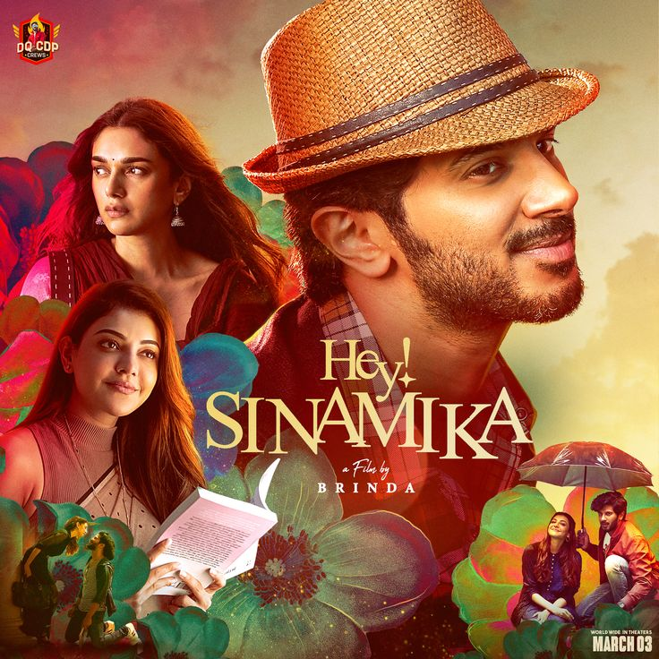

# NetFlix_Clone
## Date:
## Objective:
To create a modern, responsive navigation bar using CSS Flexbox, mimicking real-world websites like Netflix. This helps reinforce alignment, spacing, and layout structuring using Flexbox properties.

## Tasks:

#### 1. Structure the HTML Layout:
Use a ```<nav>``` tag as the main container.

Add a brand logo/title on the left using a ```<div> or <h1>```.

Add navigation links like Home, Menu, About, Contact, and Login using a ```<ul> with <li> and <a>```.

#### 2. Apply Flexbox for Layout:
Use display: flex on the ```<nav>``` container.

Use justify-content: space-between to align the logo and menu.

Use align-items: center to vertically center both sections.

Style list items with horizontal spacing using gap or margin.

#### 3. Style Like a Real-World Navbar:
Add background color (e.g., dark or gradient like Netflix/Zomato).

Style text with bold fonts, hover effects, and link styling.

Remove default ul and li styles (list-style: none, text-decoration: none).

#### 4. Bonus Enhancements:
Add a hover underline or button effect on links.

Make it responsive using flex-wrap or media queries.

Fix the nav bar to top with position: sticky.
## HTML Code:
```
<!DOCTYPE html>
<html lang="en">
  <head>
  <meta charset="UTF-8"/>
  <meta name="viewport" content="width=device-width,initial-scale=0.1"/>
  <title>Netflix Nav Clone</title>
  <link href="style.css" rel="stylesheet"/>
  </head>
  <body>
    <nav>
      <div class="logo">NETFLIX</div>
      <ul class="nav-center">
        <li><a herf="#">Home</a></li>
        <li><a href="#">Menu</a></li>
        <li><a href="#">About</a></li>
        <li><a href="#">Contact</a></li>
      </ul>
      <div class="login">
        <a href="#">Login</a>
        
      </div>
    </nav>
   <section class="hero">
    <div class="hero-content">
      <h1>The Summer I Turned Pretty</h1>
      <h2 class="meta">2022 | DIRECTOR : Erica Dunton | SEASON 1 (1 Episodes)</h2>
      <p class="description"> A coming-of-age story about Isabel "Belly" Conklin, who spends summers at Cousins Beach with her family and the Fishers.</p>
      <div class="hero-buttons">
        <button class="stream">STREAM NOW</button>
        <button class="episodes">ALL EPISODES</button>
      </div>
    </div>
    <div class="hero-trailer">
      <button class="trailer-btn">▶</button>
      <p>Watch Trailer</p>
    </div>
  </section>
    <section class="movies-section">
  <h2>Popular on Netflix</h2>
  <div class="movies-grid">
    <div class="movie-card">
      
      <p>The Rituals</p>
    </div>
    <div class="movie-card">
      
      <p>Hey Sinamika</p>
    </div>
    <div class="movie-card">
      
      <p>Demons Slayer</p>
    </div>
    <div class="movie-card">
      
      <p>Game Of Thrones</p>
    </div>
    <div class="movie-card">
      
      <p>Despicable Me 2</p>
    </div>
    <div class="movie-card">
      
      <p>20th Century Girl</p>
    </div>
  </div>
</section>

  </body>
</html>
```
## CSS Code:
```
* {
  margin: 0;
  padding: 0;
  box-sizing: border-box;
}

body {
  font-family: 'Segoe UI', sans-serif;
  background-color: #000;
  color: #fff;
}

nav {
  background: linear-gradient(to right, #111, #000);
  display: flex;
  justify-content: space-between;
  align-items: center;
  padding: 15px 30px;
  position: sticky;
  top: 0;
  z-index: 999;
}

.logo {
  font-size: 1.8rem;
  font-weight: bold;
  color: #e50914;
  flex: 1;
}

.nav-center {
  list-style: none;
  display: flex;
  gap: 25px;
  justify-content: center;
  flex: 2;
}

.nav-center a {
  text-decoration: none;
  color: white;
  font-weight: 500;
  position: relative;
}

.nav-center a:hover {
  color: #e50914;
}

.nav-center a::after {
  content: '';
  position: absolute;
  width: 0;
  height: 2px;
  bottom: -5px;
  left: 0;
  background: #e50914;
}
.login {
  display: flex;
  align-items: center;
  gap: 10px;
}

.profile-pic {
  width: 32px;
  height: 32px;
  border-radius: 50%;
  object-fit: cover;
  border: 2px solid white;
}


.login a {
  color: white;
  font-weight: 500;
  text-decoration: none;
}

.login a:hover {
  color: #e50914;
}
.hero {
  display: flex;
  justify-content: space-between;
  align-items: center;
  padding: 60px 40px;
  background: linear-gradient(to right, #000 10%, transparent), url('summerr.jpeg');
  background-size: cover;
  background-position: center;
  height: 80vh;
  position: relative;
}

.hero-content {
  max-width: 50%;
}

.tags {
  font-size: 0.8rem;
  color: #aaa;
  margin-bottom: 10px;
}

.hero h1 {
  font-size: 4rem;
  margin-bottom: 10px;
}
.hero h2 {
  font-size: 1.5rem;
}

.meta {
  font-size: 0.9rem;
  color: #ccc;
  margin-bottom: 10px;
}

.description {
  font-size: 1rem;
  margin-bottom: 20px;
  color: #ddd;
}

.hero-buttons button {
  padding: 10px 20px;
  border: none;
  margin-right: 15px;
  border-radius: 4px;
  cursor: pointer;
  font-weight: bold;
}

.stream {
  background-color: #e50914;
  color: #fff;
}

.episodes {
  background-color: #333;
  color: #fff;
}

.hero-trailer {
  display: flex;
  flex-direction: column;
  align-items: center;
  margin-right: 50px;
}

.trailer-btn {
  background-color: #fff;
  color: #000;
  border: none;
  font-size: 2rem;
  width: 60px;
  height: 60px;
  border-radius: 50%;
  cursor: pointer;
}

.hero-trailer p {
  margin-top: 10px;
  font-size: 0.9rem;
}

.movies-section {
  padding: 0px 40px;
  background-color: #191919;
}

.movies-section h2 {
  color: white;
  margin-bottom: 20px;
  font-size: 1.5rem;
}

.movies-grid {
  display: grid;
  grid-template-columns: repeat(auto-fit, minmax(160px, 1fr));
  gap: 20px;
}

.movie-card {
  background-color: #222;
  border-radius: 8px;
  overflow: hidden;
  text-align: center;
  transition: transform 0.3s ease;
}

.movie-card img {
  width: 100%;
  height: 220px;
  object-fit: cover;
}

.movie-card p {
  color: rgb(233, 226, 226);
  font-size: 0.9rem;
  padding: 10px;
  font-weight: 600;
}

.movie-card:hover {
  transform: scale(1.04);
}

@media (max-width: 768px) {
  nav {
    flex-direction: column;
    align-items: flex-start;
  }

  .nav-center {
    flex-direction: column;
    gap: 10px;
    margin-top: 10px;
  }

  .login {
    align-self: flex-end;
    margin-top: 10px;
  }

  .hero {
    flex-direction: column;
    align-items: flex-start;
    text-align: left;
    padding: 30px;
    height: auto;
  }

  .hero-trailer {
    align-self: center;
    margin-top: 20px;
  }

  .hero-content {
    max-width: 100%;
  }
}
```
## Output:


## Result:
A modern, responsive navigation bar using CSS Flexbox, mimicking real-world websites like Netflix. This helps reinforce alignment, spacing, and layout structuring using Flexbox properties is created successfully.
